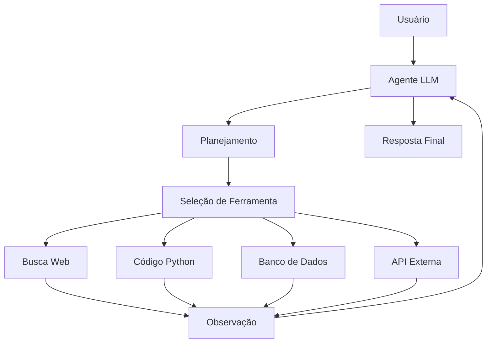

# Agentes de IA

Agentes de IA são sistemas que usam [[LLM]] como motor de raciocínio para planejar, executar ações e interagir com ferramentas de forma autônoma.

## Padrão ReAct

```
Pensamento → Ação → Observação → Pensamento → ...
```

O agente alterna entre raciocinar sobre o problema e executar ações usando ferramentas.

## Arquitetura de um Agente



## Implementação com LangChain

```python
from langchain.agents import create_react_agent, AgentExecutor
from langchain.tools import tool
from langchain.llms import Ollama

@tool
def calculadora(expressao: str) -> str:
    """Calcula expressões matemáticas."""
    return str(eval(expressao))

@tool
def buscar_conhecimento(query: str) -> str:
    """Busca informação na base de conhecimento."""
    # Integração com RAG
    return rag_chain.run(query)

llm = Ollama(model="llama3")
tools = [calculadora, buscar_conhecimento]

agent = create_react_agent(llm, tools, prompt_template)
executor = AgentExecutor(agent=agent, tools=tools, verbose=True)

resultado = executor.invoke({"input": "Qual é a raiz quadrada de 144?"})
```

## Tipos de Agentes

| Tipo | Descrição | Exemplo |
|------|-----------|---------|
| **ReAct** | Raciocínio + Ação | Resolução de problemas |
| **Plan-and-Execute** | Planejar antes de agir | Tarefas complexas |
| **Multi-Agent** | Vários agentes colaborando | Simulações, debate |
| **Tool-Using** | Foco em uso de ferramentas | Código, APIs |

## Relações no Grafo

Agentes usam [[LLM]] como motor de raciocínio.
Podem integrar [[RAG]] para acesso a conhecimento.
São implementados com [[Python]] (LangChain, CrewAI, AutoGen).

## Checklist de Estudo

- [ ] Conceito de agentes
- [ ] Padrão ReAct
- [ ] Tool calling
- [ ] LangChain agents
- [ ] CrewAI multi-agent
- [ ] Function calling com OpenAI
- [ ] Memory e estado do agente
- [ ] Guardrails e segurança
