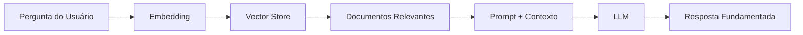

# Retrieval-Augmented Generation (RAG)

RAG é uma técnica que combina recuperação de informação com geração de texto por [[LLM]], permitindo que o modelo acesse conhecimento externo atualizado.

## Arquitetura RAG



## Pipeline Completo

### 1. Ingestão de Documentos

```python
from langchain.text_splitter import RecursiveCharacterTextSplitter
from langchain.embeddings import HuggingFaceEmbeddings
from langchain.vectorstores import Chroma

# Dividir documentos em chunks
splitter = RecursiveCharacterTextSplitter(
    chunk_size=512,
    chunk_overlap=50,
    separators=["\n\n", "\n", ". ", " "]
)
chunks = splitter.split_documents(documents)

# Criar embeddings e armazenar
embeddings = HuggingFaceEmbeddings(
    model_name="sentence-transformers/all-MiniLM-L6-v2"
)
vectorstore = Chroma.from_documents(chunks, embeddings)
```

### 2. Recuperação e Geração

```python
from langchain.chains import RetrievalQA
from langchain.llms import Ollama

llm = Ollama(model="llama3")
retriever = vectorstore.as_retriever(search_kwargs={"k": 4})

chain = RetrievalQA.from_chain_type(
    llm=llm,
    chain_type="stuff",
    retriever=retriever
)

resposta = chain.run("Como funciona o mecanismo de atenção?")
```

## Estratégias Avançadas

- **Hybrid Search**: Combinar busca vetorial + BM25
- **Re-ranking**: Reordenar resultados com cross-encoder
- **Query Expansion**: Expandir a query com termos relacionados
- **Chunk Optimization**: Ajustar tamanho e overlap dos chunks
- **Metadata Filtering**: Filtrar por metadados antes da busca vetorial

## Relações no Grafo

RAG depende de [[LLM]] para geração de respostas.
Pode ser combinado com [[Agentes de IA]] para workflows complexos.
Implementado primariamente em [[Python]].

## Checklist de Estudo

- [ ] Conceitos de embeddings
- [ ] Vector stores (Chroma, FAISS, Pinecone)
- [ ] Chunking strategies
- [ ] Pipeline RAG básico
- [ ] Re-ranking
- [ ] Hybrid search
- [ ] Avaliação de RAG (faithfulness, relevance)
- [ ] RAG avançado (agentic RAG)
